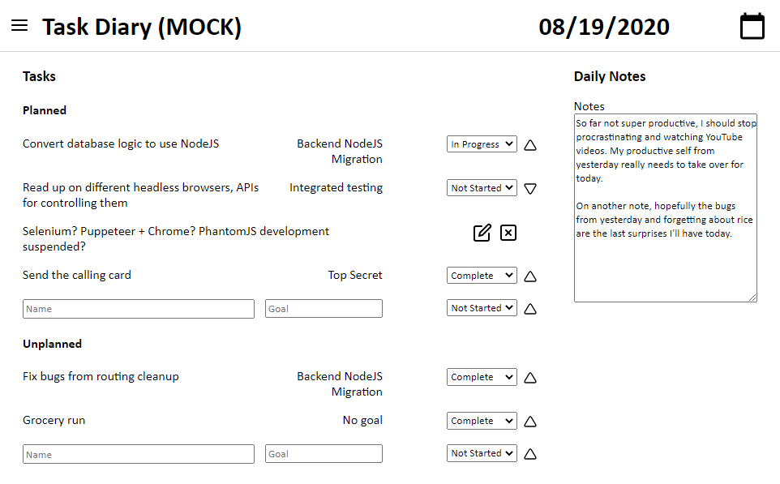

# Task Diary

An app to record daily planned/ completed tasks to help with evaluating personal performance.

See https://eriwang.github.io/task_diary/ for a demo version of the application. **Note that this is just a demo mode, and will not save your changes.**

## First Time Setup

- You should have `python3` (3.6+), `node`, and `npm` installed.
- Run `scripts/setup.sh` from repo root.
    - This will install all `node`/ `python` dependencies, and create a Python virtualenv.
    - This will also install git hooks, which do style checks for the repo.

## Running the Server in a Development Environment

### Development Mode

Do the following from repo root:

- Activate your virtualenv
- Run `python backend_src/app.py`
- Run `npm run run-dev`

Flask and webpack will continue to monitor changes to files as long as the commands are running.

### Demo/ Mock Mode

This mode will create a static version of the site where all the API calls are changed to function calls to a "dummy" backend. This is meant to be used for testing as well as demonstration purposes.

Do the following from repo root:

- Copy `docs/index.html` from [release/github_pages_site](https://github.com/eriwang/task_diary/tree/release/github_pages_site)
- Run `npm run run-dev-mock`

`run-dev-mock` will continue to monitor file changes as long as it is running.

Note that there is also a `package-mock` target: this just builds the mock mode and puts the files in `docs/`. This is meant to be used for the GitHub pages site, which is released from `release/github_pages_site`.

## Deployment

Do the following from repo root:

- Activate your virtualenv
- `scripts/build_prod.<bat|sh>` (depending on file system)

This will create a single executable that bundles the Flask server and the HTML/ CSS/ JS. Run this executable normally, and go to the `localhost` URL shown in the command prompt popup to use the site.

## Credits

SVG for all icons used taken from https://feathericons.com/.